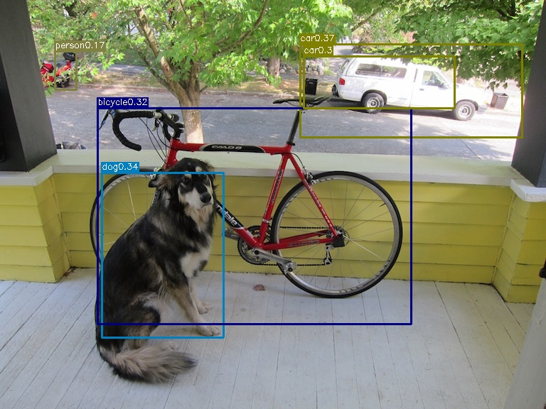
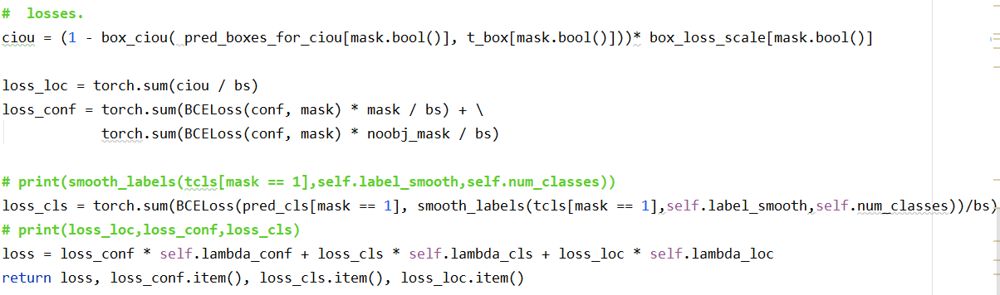

[toc]


<center><h1>YOLOv1</h1></center>

Github地址：https://github.com/Fenghaze/yolov1

# YOLOv1核心思想


==使用网格划分图片，每个网格进行监督学习的任务==

每个网格的任务如下：

- 预测B个bbox（$x,y,w,h$）
- 计算每个bbox的置信度
- 计算C个类别的预测值，选择最大概率作为预测类别


# YOLOv1网络结构


- 网络结构借鉴了 GoogleNet ：24个卷积层，2个全连接层

- 输入tensor：[n，3，448，448]

- 输出tensor：[n，7，7，30]

- 模型参数量与计算量

  

# YOLOv1损失函数


参数解析：

- S：网格大小，$S^2$ 表示网格个数
- B：每个网格需要预测的bbox个数
- C：预测bbox的置信度
- $1^{obj}_{ij}$ ：如果网格中有目标，则为1，否则为0
- $λ_{coord}$， $λ_{noobj}$ 是超参数，控制损失权重，在论文中分别取5, 0.5
  - Yolo面临的物体检测问题，是一个典型的类别数目不均衡的问题。其中49个网格，含有物体的网格往往只有3、4个，其余全是不含有物体的网格。此时如果不采取点措施，那么物体检测的mAP不会太高，因为模型更倾向于不含有物体的网格。![[公式]](https://www.zhihu.com/equation?tex=%5Clambda_%7Bcoord%7D+) 与 ![[公式]](https://www.zhihu.com/equation?tex=%5Clambda_%7Bnoobj%7D+)的作用，就是让含有物体的网格，在损失函数中的权重更大，**让模型更加“重视”含有物体的格点所造成的损失**

公式解析：

计算了两种损失：当网格没有检测到目标时，只需要计算置信度误差（公式4）；当网格检测到目标时，需要额外计算坐标误差损失和置信度的损失

- （1）计算所有bbox的长宽误差
- （2）计算所有bbox的宽高误差
- （3）和（4）计算所有bbox的置信度误差，当该网格不含有物体时，该置信度的标签为0；若含有物体时，该置信度的标签为预测框与真实物体框的IOU数值
- （5）计算预测目标类别概率和真实标签的误差

```python
def forward(self, pred_tensor, target_tensor):
    """
    pred_tensor: (tensor) size(batchsize,S,S,Bx5+20=30) [x,y,w,h,c]
    target_tensor: (tensor) size(batchsize,S,S,30)
    """
    N = pred_tensor.size()[0]   # batchsize
    # 具有目标标签的索引(bs, 14, 14, 30)中14*14方格中的哪个方格包含目标
    # target_tensor[:, :, :, 4]是置信度值，如果置信度>0，说明有目标
    coo_mask = target_tensor[:, :, :, 4] > 0  # coo_mask.shape = [bs, 14, 14]
    noo_mask = target_tensor[:, :, :, 4] == 0  # 不具有目标的标签索引

    # 得到含物体的坐标等信息(coo_mask扩充到与target_tensor一样形状, 沿最后一维扩充)
    coo_mask = coo_mask.unsqueeze(-1).expand_as(target_tensor)  # 有目标的位置为True，大部分为False
    noo_mask = noo_mask.unsqueeze(-1).expand_as(target_tensor)  # 有目标的位置为False，大部分为True

    # coo_pred 取出预测结果中有物体的网格，并改变形状为 [xxx,30]
    # xxx代表一个batch的图片上的存在物体的网格总数
    coo_pred = pred_tensor[coo_mask].view(-1, 30)
    # box_pred 2个bbox的预测值
    box_pred = coo_pred[:, :10].contiguous().view(-1, 5)  # box[x1,y1,w1,h1,c1], [x2,y2,w2,h2,c2]
    # class_pred 网格的分类概率
    class_pred = coo_pred[:, 10:]

    # 真实标签中有物体的网格对应的数值
    coo_target = target_tensor[coo_mask].view(-1, 30)
    box_target = coo_target[:, :10].contiguous().view(-1, 5)
    class_target = coo_target[:, 10:]

    # ---------计算损失1：计算不包含目标，即标签为0的网格的损失------------
    noo_pred = pred_tensor[noo_mask].view(-1, 30)   # 如tensor([195, 30])，表示有195个没有目标的网格，值为预测值
    noo_target = target_tensor[noo_mask].view(-1, 30)   # 值为标签值，均为0

    # 定义一个与noo_pred同等shape的掩码
    noo_pred_mask = torch.cuda.ByteTensor(noo_pred.size()).bool()
    noo_pred_mask.zero_()   # 初始化为0
    # bbox置信度置为True
    noo_pred_mask[:, 4] = 1
    noo_pred_mask[:, 9] = 1
    # 使用掩码获取noo_pred对应位置的置信度值
    noo_pred_c = noo_pred[noo_pred_mask]  # tensor([390])，390=195*2，表示获取了195个网格中的所有预测的置信度值
    noo_target_c = noo_target[noo_pred_mask]    # 所有真实标签的置信度值，均为0
    # -----公式（4）：网格没有物体时的置信度损失-----
    nooobj_loss = F.mse_loss(noo_pred_c, noo_target_c, size_average=False)

    # ---------计算损失2：计算包含目标的网格的损失---------------------------
    # 定义一个与box_target同等shape的掩码
    coo_response_mask = torch.cuda.ByteTensor(box_target.size()).bool()
    coo_response_mask.zero_()
    coo_not_response_mask = torch.cuda.ByteTensor(box_target.size()).bool()
    coo_not_response_mask.zero_()
    # iou
    box_target_iou = torch.zeros(box_target.size()).cuda()
    # 选择最好的IOU
    # 从有目标的网格中，选择最好的IOU
    for i in range(0, box_target.size()[0], 2):
        box1 = box_pred[i:i+2]   # 第i个有目标的网格的2个bbox
        box1_xyxy = torch.FloatTensor(box1.size())
        # (x,y,w,h)
        box1_xyxy[:, :2] = box1[:, :2]/14. - 0.5 * box1[:, 2:4]
        box1_xyxy[:, 2:4] = box1[:, :2]/14. + 0.5 * box1[:, 2:4]
        box2 = box_target[i].view(-1, 5)    # 第i个有目标的网格的bbox标签
        box2_xyxy = torch.FloatTensor(box2.size())
        box2_xyxy[:, :2] = box2[:, :2]/14. - 0.5*box2[:, 2:4]
        box2_xyxy[:, 2:4] = box2[:, :2]/14. + 0.5*box2[:, 2:4]
        iou = self.compute_iou(box1_xyxy[:, :4], box2_xyxy[:, :4])  # [2,1]
        max_iou, max_index = iou.max(0) # 获取最大的iou值及其bbox索引
        max_index = max_index.data.cuda()
        # 设置掩码，将索引位置对应的bbox设为true
        coo_response_mask[i+max_index] = 1
        coo_not_response_mask[i+1-max_index] = 1

        #####
        # we want the confidence score to equal the
        # intersection over union (IOU) between the predicted box
        # and the ground truth
        #####
        # iou value 作为box包含目标的confidence(赋值在向量的第五个位置)
        box_target_iou[i+max_index, torch.LongTensor([4]).cuda()] = (max_iou).data.cuda()
   	box_target_iou = box_target_iou.cuda() # tensor[[0,0,0,0,0], [0,0,0,0,max_iou)]]

    # 使用coo_response_mask选择最佳的预测bbox和对应的iou
    box_pred_response = box_pred[coo_response_mask].view(-1, 5)
    box_target_response_iou = box_target_iou[coo_response_mask].view(-1, 5)
    box_target_response = box_target[coo_response_mask].view(-1, 5)
    # ----公式（3）：网格有物体时的置信度损失----
    contain_loss = F.mse_loss(box_pred_response[:, 4], box_target_response_iou[:, 4], size_average=False)
    # ----公式（1）+（2）：网格有物体时的bbox位置损失-----
    loc_loss = F.mse_loss(box_pred_response[:, :2], box_target_response[:, :2], size_average=False) + F.mse_loss(torch.sqrt(box_pred_response[:, 2:4]), torch.sqrt(box_target_response[:, 2:4]), size_average=False)

    # 2.not response loss
    box_pred_not_response = box_pred[coo_not_response_mask].view(-1, 5)
    box_target_not_response = box_target[coo_not_response_mask].view(-1, 5)
    box_target_not_response[:, 4] = 0
    # not_contain_loss = F.mse_loss(box_pred_response[:,4],box_target_response[:,4],size_average=False)

    # I believe this bug is simply a typo
    not_contain_loss = F.mse_loss(box_pred_not_response[:, 4], box_target_not_response[:, 4], size_average=False)

    # -----公式（5）：类别损失-------
    class_loss = F.mse_loss(class_pred, class_target, size_average=False)

    return (self.l_coord*loc_loss + self.B*contain_loss + not_contain_loss + self.l_noobj*nooobj_loss + class_loss)/N
```


# 使用YOLOv1训练VOC数据集

数据集：VOC2007+VOC2012共16551张，20个分类对象

训练集：验证集=8:2

- batchsize=8

- epochs=50

  |    epochs     | learning_rate |
  | :-----------: | :-----------: |
  | 0＜epochs≤30  |     0.001     |
  | 30＜epochs≤40 |    0.0001     |
  | 40＜epochs≤50 |    0.00001    |

## 制作训练标签


<center>
	<small>图片摘自https://blog.csdn.net/qq_43602882/article/details/105910176</small>
</center>

==标签：tensor[S, S, 30]，初始化为0；制作标签时，仅对有对象的网格赋值==

对于划分的每一个网格，都有对应的标签来进行监督训练，标签由以下两部分组成：

（1）20个类别标签

**图中有n个对象，就只有n个网格具有分类标签，其余网格的分类标签均为0**

例如，狗被标注了一个蓝色框，蓝色框中心是那个蓝色的圆点，圆点所在的网格（图中蓝色阴影的网格）对狗这个Object负责

蓝色阴影的网格对应的30维张量中的20个分类概率中，dog设为1，其他19个类设为0；同样的黄色阴影网格类别概率中bicycle设为1，其余19个位0；粉色grid cell类别概率中car设为1，其余19个类设为0

也就是说即使一个对象横跨了众多网格，也只关心这个对象中心点所在的网格，那剩下的网格中的20个对象分类概率都为0

（2）2个bbox位置及其置信度

已经知道标注的bbox真实位置，需要求出这些bbox由哪个网格负责（代码求的是ij值），对这些网格赋值2个bbox位置，置信度均置为1；其余网格的bbox位置和置信度均为0

```python
def encoder(self, boxes, labels):
    '''
    boxes：图片中标注的所有bboxes(tensor) [bbox1, bbox2, ...] = [[x1,y1,x2,y2], [...], ...]
    labels (tensor) [...]
    return 7x7x30
    '''
    grid_num = 14 # 论文中设为7
    target = torch.zeros((grid_num, grid_num, 30))  # label初始化[14, 14, 30]
    cell_size = 1./grid_num  # 之前已经把目标框归一化，故这里用1. 作为除数
    wh = boxes[:, 2:]-boxes[:, :2]  # 宽高
    cxcy = (boxes[:, 2:]+boxes[:, :2])/2  # 中心坐标
    # 只对有对象的网格进行赋值；假设图片中有3个对象，那么就找到对应的3个网格进行赋值
    for i in range(cxcy.size()[0]):    # 对于数据集中的每个框，这里cxcy.size() == num_samples
        cxcy_sample = cxcy[i]
        # ij 是一个list, 记录目标中心点cxcy在归一化后的图片中所处的x y方向的第几个网格
        ij = (cxcy_sample/cell_size).ceil()-1
        # [中心坐标,长宽,置信度,中心坐标,长宽,置信度, 20个类别] x 7x7
        target[int(ij[1]), int(ij[0]), 4] = 1  # 第一个bbox的置信度
        target[int(ij[1]), int(ij[0]), 9] = 1  # 第二个bbox的置信度
        target[int(ij[1]), int(ij[0]), int(labels[i])+9] = 1    # 目标所属类别标签
        xy = ij*cell_size  # 匹配到划分后的子网格的左上角相对坐标
        # delta_xy对于目标中心点落入的子网格，目标中心坐标相对于子网格左上点的位置比例
        delta_xy = (cxcy_sample -xy)/cell_size
        # 坐标w,h代表了预测边界框的width、height相对于整幅图像width,height的比例，范围为(0,1)
        target[int(ij[1]), int(ij[0]), 2:4] = wh[i]     # 第一个bbox的宽、高
        target[int(ij[1]), int(ij[0]), :2] = delta_xy   # 第一个bbox的中心坐标
        target[int(ij[1]), int(ij[0]), 7:9] = wh[i]     # 第二个bbox的宽、高
        target[int(ij[1]), int(ij[0]), 5:7] = delta_xy  # 第二个bbox的中心坐标
        return target	# shape=[14, 14, 30]
```


## 后处理

分为两个步骤：

- （1）先从所有的预测bboxes（SxSxB个）中选取符合条件的bboxes
- （2）再使用NMS进一步筛选出最精确的bboxes

```python
def decoder(pred):
    """
    pred (tensor)  torch.Size([1, 14, 14, 30])
    return (tensor) box[[x1,y1,x2,y2]] label[...]
    """
    grid_num = 14
    boxes = []
    cls_indexs = []
    probs = []
    cell_size = 1./grid_num
    pred = pred.data  # torch.Size([1, 14, 14, 30])
    pred = pred.squeeze(0)  # torch.Size([14, 14, 30])
    # 获取所有网格的bbox置信度
    contain1 = pred[:, :, 4].unsqueeze(2)  # torch.Size([14, 14, 1])
    contain2 = pred[:, :, 9].unsqueeze(2)  # torch.Size([14, 14, 1])
    contain = torch.cat((contain1, contain2), 2)    # torch.Size([14, 14, 2])
    # 筛选预测的bbox所用的掩码
    mask1 = contain > 0.1  # 大于阈值, torch.Size([14, 14, 2])
    mask2 = (contain == contain.max())
    mask = (mask1+mask2).gt(0)
    # -------------先从所有的预测bboxes（SxSxB个）中选取符合条件的bboxes---------------
    # 遍历所有网格，总共有14*14*2个bbox，选取（最大概率*置信度>0.1）的bbox存入boxes列表中，后续使用nms再剔除冗余的bbox
    for i in range(grid_num):
        for j in range(grid_num):
            for b in range(2):
                # index = min_index[i,j]
                # mask[i,j,index] = 0
                if mask[i, j, b] == 1:
                    box = pred[i, j, b*5:b*5+4] # bbox位置信息
                    contain_prob = torch.FloatTensor([pred[i, j, b*5+4]])   # bbox置信度
                    xy = torch.FloatTensor([j, i])*cell_size  # cell左上角  up left of cell
                    box[:2] = box[:2]*cell_size + xy
                    box_xy = torch.FloatTensor(box.size())
                    box_xy[:2] = box[:2] - 0.5*box[2:]
                    box_xy[2:] = box[:2] + 0.5*box[2:]
                    max_prob, cls_index = torch.max(pred[i, j, 10:], 0) # 有目标的网格类别的最大概率及其对应标签
                    if float((contain_prob*max_prob)[0]) > 0.1:
                        boxes.append(box_xy.view(1, 4))
                        cls_indexs.append(cls_index.item())
                        probs.append(contain_prob*max_prob)
    if len(boxes) == 0:
        boxes = torch.zeros((1, 4))
        probs = torch.zeros(1)
        cls_indexs = torch.zeros(1)
    else:
        boxes = torch.cat(boxes, 0)  # (n,4)
        probs = torch.cat(probs, 0)  # (n,)
        cls_indexs = torch.IntTensor(cls_indexs)  # (n,)
   	# --------------nms消除冗余bbox-------------------
    keep = nms(boxes, probs)   
    a = boxes[keep]
    b = cls_indexs[keep]
    c = probs[keep]
    return a, b, c
```

## 训练曲线

中途断线了一次，图片只显示了训练32个epochs时的训练曲线


验证集loss曲线在epoch=8上升在epoch=28下降；训练集loss一直在下降

可能原因，模型过拟合；将数据集进行shuffle再训练

## Metrics：计算AP/mAP

- AP：单分类平均精确率（需要求Precision和Recall）
  - Precision=预测的正样本数/测试集总样本数
  - Recall=预测的正样本数/测试集正样本数
- mAP：平均AP（所有类的AP之和/类别总数）


准备工作：

- （1）准备一个测试集文件夹以及测试集图的test_label.txt
- （2）提取test_lable.txt中的相关信息，以如下的形式保存到字典中：保存的是每张图片的bbox和分类标签

```python
target = {('image01.jpg','cat'):[[x1, y1, x2, y2]],('image01.jpg','dog'):[[x1, y1, x2, y2]],('image02.jpg','cat'):[[x1, y1, x2, y2]], ...}
```

- （3）计算测试集的pred
- （4）解析pred的信息，以如下形式保存到字典中：保存的是每个类别下的图片名，bbox和置信度

```python
preds = {'cat':[['image01.jpg', c, x1, y1, x2, y2],['image01.jpg', c, x1, y1, x2, y2],['image02.jpg', c, x1, y1, x2, y2]],'dog':[['image01.jpg', c, x1, y1, x2, y2]], ...}
```

- （5）计算AP/mAP

```python
def voc_eval(preds, target, VOC_CLASSES, threshold=0.5, use_07_metric=False,):
    '''
    preds：每个分类下对应的测试图片名和bbox， {'cat':[[image1,confidence,x1,y1,x2,y2],...],'dog':[[],...]}
    target ：所有测试图片的类别和bbox信息，{(image1, 'cat'):[[x1, y1, x2, y2]], (image1, 'dog'):[[]] }
    '''
    aps = []
    for i,class_ in enumerate(VOC_CLASSES):
        # pred：获取预测出当前类别的所有图片及其bbox（正负样本）
        pred = preds[class_]  # [[image_id,confidence,x1,y1,x2,y2],...]
        if len(pred) == 0:  # 如果这个类别一个都没有检测到的异常情况
            ap = -1
            print('---class {} ap {}---'.format(class_,ap))
            aps += [ap]
            #break  #test_eval()时使用break
            continue
        # 解析pred
        image_ids = [x[0] for x in pred]    # 获取预测出当前类别的所有图片名称，图片名可重复
        confidence = np.array([float(x[1]) for x in pred])  # 获取对应的置信度
        BB = np.array([x[2:] for x in pred])    # 获取对应的bbox
        # sort by confidence：根据置信度由大到小对pred进行排序
        sorted_ind = np.argsort(-confidence)
        sorted_scores = np.sort(-confidence)
        BB = BB[sorted_ind, :]
        image_ids = [image_ids[x] for x in sorted_ind]

        # go down dets and mark TPs and FPs
        npos = 0.   # 测试集中正样本个数
        for (key1,key2) in target:  #key1：图片名， key2：类别标签
            # 统计这个类别的正样本，
            if key2 == class_:
                npos += len(target[(key1,key2)])
        nd = len(image_ids) # 检测为这个类别的所有样本数（正负样本）
        tp = np.zeros(nd)   # 记录
        fp = np.zeros(nd)
        for d,image_id in enumerate(image_ids):
            bb = BB[d] #预测框
            # 如果标签中存在与之对应的组合，就可以计算
            if (image_id,class_) in target:
                BBGT = target[(image_id,class_)] #获取对应的真实bbox值
                for bbgt in BBGT:
                    # compute overlaps
                    # intersection
                    ixmin = np.maximum(bbgt[0], bb[0])
                    iymin = np.maximum(bbgt[1], bb[1])
                    ixmax = np.minimum(bbgt[2], bb[2])
                    iymax = np.minimum(bbgt[3], bb[3])
                    iw = np.maximum(ixmax - ixmin + 1., 0.)
                    ih = np.maximum(iymax - iymin + 1., 0.)
                    inters = iw * ih
                    union = (bb[2]-bb[0]+1.)*(bb[3]-bb[1]+1.) + (bbgt[2]-bbgt[0]+1.)*(bbgt[3]-bbgt[1]+1.) - inters
                    if union == 0:
                        print(bb,bbgt)
                    overlaps = inters/union
                    if overlaps > threshold:
                        tp[d] = 1
                        BBGT.remove(bbgt) #这个框已经匹配到了，不能再匹配
                        if len(BBGT) == 0:
                            del target[(image_id,class_)] #删除没有box的键值
                        break
                fp[d] = 1-tp[d]
            else:
                fp[d] = 1
        fp = np.cumsum(fp)  # false positive：负样本数
        tp = np.cumsum(tp)  # true positive：正样本数
        rec = tp/float(npos)    # 正样本/测试集正样本数=召回率
        prec = tp/np.maximum(tp + fp, np.finfo(np.float64).eps) # 正样本/测试集总样本数=精确率
        #print(rec,prec)
        ap = voc_ap(rec, prec, use_07_metric)
        print('---class {} ap {}---'.format(class_,ap))
        aps += [ap]
    print('---map {}---'.format(np.mean(aps)))
```

### 模型在验证集上的表现


### 模型在VOC2007测试集上的表现


在某些类别上表现不佳，认为是样本不均衡的问题

## 图片检测效果


- dog的bbox定位不精准，car出现两个bbox，背景的car误判为person



## 实时检测效果


检测效果：模型精度低，不稳定，会出现误判情况


# 使用YOLOv1训练自己的数据集

## 制作数据集

数据集：26张1元，5角，1角的图片，3个分类对象

训练集：验证集=8:2

- batchsize=8
- epochs=30
- lr=0.001


```shell
# 标签示例：images.txt
# image_nam x1 x2 y1 y2 cls_index ...
P00524-151929.jpg 2678 295 3073 714 0 2211 558 2618 965 0 2450 1109 2822 1492 0 3265 1444 3648 1804 0 989 965 1373 1361 0 774 1552 1157 1911 0 1085 1995 1420 2313 0 1666 2121 2007 2450 0 1935 349 2247 678 1 1253 2355 1540 2618 1 1756 1540 2043 1792 2
```


## 图片检测效果


检测效果：能检测出所有对象，能够区分出三类硬币

# YOLOv1缺点

- 每个网格的bboxes只能预测出一个对象，当同一网格中出现多个对象时，无法精准定位
- 从实验结果来看，NMS后处理有时并没有保留最精确的bbox，出现一个物体有多个bbox的情况


<center><h1>YOLOv2</h1></center>

# YOLOv2核心思想

YOLOv1使用7x7网格将图片进行划分，每个网格都预测2个bboxes，每个网格的一对bbox只能预测单一分类，总共需要预测7x7x2=98个bboxes

YOLOv1直接对bbox的坐标求回归会导致模型不稳定，其中心点可能会出现在图像任何位置，有可能导致回归过程震荡，甚至无法收敛，尤其是在最开始的几次迭代的时候。大多数不稳定因素产生自预测bbox的中心坐标（x,y）位置的时候

**改进：**

==YOLOv2使用anchor boxes来预测bounding boxes的偏移量==

使用了13x13网格将图片进行划分，**引入了RPN的锚点机制（使用k-means学习人工标注的bbox信息，获得5类固定比例的anchor boxes）**后，每个网格根据比例产生5个prior anchor boxes ，再计算出5个bboxes与对应prior anchor box的偏移量，每个bbox预测一组分类概率值，总共需要预测13x13x5=845个bboxes


## k-means求anchors

k-means聚类的算法运行过程可以总结如下：

（1）随机选择k个初始聚类中心

（2）计算每个对象与这k个中心各自的距离，按照最小距离原则分配到最邻近聚类

（3）使用每个聚类中的样本均值作为新的聚类中心

（4）重复步骤（2）和（3）直到聚类中心不再变化

（5）结束，得到k个聚类


**计算公式：**

已知：box1=(w1,h1)；box2=(w2,h2)

box1和box2 的交并比（IOU）：


YOLOv2中不使用最小距离分配原则，使用如下公式来计算两个框的距离


```python
#coding=utf-8
import xml.etree.ElementTree as ET
import numpy as np

def iou(box, clusters):
    """
    计算一个ground truth边界盒和k个先验框(Anchor)的交并比(IOU)值。
    参数box: 元组或者数据，代表ground truth的长宽。
    参数clusters: 形如(k,2)的numpy数组，其中k是聚类Anchor框的个数
    返回：ground truth和每个Anchor框的交并比。
    """
    x = np.minimum(clusters[:, 0], box[0])
    y = np.minimum(clusters[:, 1], box[1])
    if np.count_nonzero(x == 0) > 0 or np.count_nonzero(y == 0) > 0:
        raise ValueError("Box has no area")
    intersection = x * y
    box_area = box[0] * box[1]
    cluster_area = clusters[:, 0] * clusters[:, 1]
    iou_ = intersection / (box_area + cluster_area - intersection)
    return iou_

def avg_iou(boxes, clusters):
    """
    计算一个ground truth和k个Anchor的交并比的均值。
    """
    return np.mean([np.max(iou(boxes[i], clusters)) for i in range(boxes.shape[0])])

def kmeans(boxes, k, dist=np.median):
    """
    利用IOU值进行K-means聚类
    参数boxes: 形状为(r, 2)的ground truth框，其中r是ground truth的个数
    参数k: Anchor的个数
    参数dist: 距离函数
    返回值：形状为(k, 2)的k个Anchor框
    """
    # 即是上面提到的r
    rows = boxes.shape[0]
    # 距离数组，计算每个ground truth和k个Anchor的距离
    distances = np.empty((rows, k))
    # 上一次每个ground truth"距离"最近的Anchor索引
    last_clusters = np.zeros((rows,))
    # 设置随机数种子
    np.random.seed()

    # （1）初始化聚类中心，k个簇，从r个ground truth随机选k个
    clusters = boxes[np.random.choice(rows, k, replace=False)]
    # 开始聚类
    while True:
        # （2）计算每个ground truth和k个Anchor的距离，用1-IOU(box,anchor)来计算
        for row in range(rows):
            distances[row] = 1 - iou(boxes[row], clusters)
        # 对每个ground truth，选取距离最小的那个Anchor，并存下索引
        nearest_clusters = np.argmin(distances, axis=1)
        # 如果当前每个ground truth"距离"最近的Anchor索引和上一次一样，聚类结束
        if (last_clusters == nearest_clusters).all():
            break
        # 更新簇中心为簇里面所有的ground truth框的均值
        for cluster in range(k):
            clusters[cluster] = dist(boxes[nearest_clusters == cluster], axis=0)
        # 更新每个ground truth"距离"最近的Anchor索引
        last_clusters = nearest_clusters

    return clusters

# 加载自己的数据集，只需要所有labelimg标注出来的xml文件即可
def load_dataset(path):
    dataset = []
    for xml_file in glob.glob("{}/*xml".format(path)):
        tree = ET.parse(xml_file)
        # 图片高度
        height = int(tree.findtext("./size/height"))
        # 图片宽度
        width = int(tree.findtext("./size/width"))
        
        for obj in tree.iter("object"):
            # 偏移量
            xmin = int(obj.findtext("bndbox/xmin")) / width
            ymin = int(obj.findtext("bndbox/ymin")) / height
            xmax = int(obj.findtext("bndbox/xmax")) / width
            ymax = int(obj.findtext("bndbox/ymax")) / height
            xmin = np.float64(xmin)
            ymin = np.float64(ymin)
            xmax = np.float64(xmax)
            ymax = np.float64(ymax)
            if xmax == xmin or ymax == ymin:
                print(xml_file)
            # 将长宽放入dateset，运行kmeans获得Anchors
            dataset.append([xmax - xmin, ymax - ymin])
    return np.array(dataset)
 
if __name__ == '__main__':
    ANNOTATIONS_PATH = "Annotations" #xml文件所在文件夹
    CLUSTERS = 5 #聚类数量，anchor数量
    INPUTDIM = 416 #输入网络大小
 
    data = load_dataset(ANNOTATIONS_PATH)
    out = kmeans(data, k=CLUSTERS)
    print('Boxes:')
    print(np.array(out)*INPUTDIM)    
    print("Accuracy: {:.2f}%".format(avg_iou(data, out) * 100))       
    final_anchors = np.around(out[:, 0] / out[:, 1], decimals=2).tolist()
    print("Before Sort Ratios:\n {}".format(final_anchors))
    print("After Sort Ratios:\n {}".format(sorted(final_anchors)))
```


## 偏移量计算方法

黑色虚线框是prior anchor box，蓝色矩形框就是预测的bbox，预测出的bbox的坐标和宽高为（bx,by）和（bw,bh），pw和ph是某个prior anchor box的宽和高，一个格子的Cx和Cy单位都是1，σ(tx)，σ(ty)是相对于某个格子左上角的偏移量


每个网格的任务如下：

- 预测5个bboxes
- 计算每个bbox与prior anchor box的偏移量（tx，ty，tw，th）
- 计算每个bbox的置信度（c）
- 计算每个bbox检测到的物体的20个分类的对应概率


# YOLOv2网络结构


- 由Draknet19和3层检测网络组成，包含基本的卷积层，最大池化层和1*1卷积；还使用了融合层，学习多尺度特征，共32层

- 输入tensor：[n，3，416，416]

- 输出tensor：[n，13，13，125]

- 模型计算量以及参数量


# YOLOv2损失函数

原理与YOLOv1相似，**检测到目标的网格**，从预测的5个bboxes中选取IOU最大的那个bbox与prior anchor box计算坐标误差，置信度误差以及分类误差，而其它4个bbox只计算置信度误差


# 使用YOLOv2训练VOC数据集

数据集：VOC2007+VOC2012共13240张，20个分类对象

- batchsize=8

- epochs=50

  |    epochs     | learning_rate |
  | :-----------: | :-----------: |
  | 0＜epochs≤30  |     0.001     |
  | 30＜epochs≤40 |    0.0001     |
  | 40＜epochs≤50 |    0.00001    |

## 训练曲线

在epoch=15后，total_loss迅速上升，认为是在此时陷入了局部最优


重新调整学习率并对数据集进行shuffle：当epoch>=15时，lr调整为0.0001，继续训练


## 图片检测效果

相比于YOLOv1的结果，bbox精确度有显著提升


<center><h1>YOLOv3</h1></center>

Github地址：https://github.com/Fenghaze/yolov3

# YOLOv3核心思想

**改进：**

- YOLO v3可以进行**3种不同尺度的预测**。检测层在分别具有步幅32,16,8的三种不同尺寸的特征图上进行检测。这意味着，在输入416 x 416的情况下，分别在为13 x 13,26 x 26和52 x 52的网格上进行检测，这3种网格对应3类anchor box，总共需要预测（13x13+26x26+52x52）x3=10647个bboxes

  - 在每个尺度上，每个单元使用3个prior anchor boxes来预测3个bbxes，prior anchor boxes总数为9（在不同尺度上的prior anchor boxes的尺寸是不同的）

  - 图中蓝色框为聚类得到的prior anchor boxes，黄色框是ground truth，红框是对象中心点所在的网格

    13x13的感受野最大，适合检测大目标，26x26的感受野适中，适合检测一般目标，52x52的感受野最小，适合检测小目标

- **将原来用于单标签多分类的softmax层换成用于多标签多分类的逻辑回归层。**在一些复杂场景下，**一个object可能属于多个类**，比如类别中有woman和person这两个类，那么如果一张图像中有一个woman，那么**检测的结果中类别标签就要同时有woman和person两个类**，这就是**多标签分类**，需要用逻辑回归层的sigmoid函数来**对每个类别做二分类**


每个网格的任务如下：

- 预测3个bboxes
- 计算每个bbox与prior anchor box的偏移量（tx，ty，tw，th）
- 计算每个bbox的置信度（c）
- 计算每个bbox检测到的物体的20个分类的对应概率（多标签多分类概率）


# YOLOv3网络结构


- Darknet53的前面的52层（没有全连接层），大量使用残差网络的skip connection，并且为了降低池化带来的梯度负面效果，没有使用池化层，使用的是stride=2的卷积来进行降采样；为了加强算法对小目标检测的精确度，在多个scale的feature map上进行检测，共252层
- 输入tensor：[n，3，416，416]
- 输出三种尺度的tensor：[n，13，13，75]，[n，26，26，75]，[n，52，52，75]
- 模型计算量以及参数量


# 使用YOLOv3训练VOC数据集

数据集：VOC2007+VOC2012共16551张，20个分类对象

- batchsize=8
- epochs=50
- lr=0.0001

## 制作训练标签

（1）将VOC0712训练集的每个`.xml`文件转换为右边`.txt`格式，将bbox的（xmin, ymin, xmax, ymax）归一化为（x, y, w, h）

```python
# 转换代码
def convert(size, box):
    """
    convert(xmin, ymin, xmax, ymax) to (x, y, w, h)
    normalize x,y,w,h with width and height of the picture
    :param size: (w, h) of image
    :param box: (xmin, xmax, ymin, ymax)
    :return:
    """
    dw = 1./size[0]
    dh = 1./size[1]
    x = (box[0] + box[1])/2.0
    y = (box[2] + box[3])/2.0
    w = box[1] - box[0]
    h = box[3] - box[2]
    x = x * dw
    w = w * dw
    y = y * dh
    h = h * dh
    return x, y, w, h
```


（2）制作用于训练的target，trainloader返回的GT的shape为[n, 50x5]

- 计算GT与所有预测的bboxes的iou，根据阈值筛选掉一批预测的bboxes
- 每个网格预测的bboxes只选取iou最大的那个bboxes与GT计算有目标的损失

```python
    def build_targets(self, pred_boxes, target, anchors, nA, nH, nW):
        """
        :param pred_boxes: (nB*nA*nH*nW, 4)，网络预测的所有bboxes
        :param target: (batch_size, 250)，每张图片最多有50个检测对象，每个bbox有5个值（x, y, w, h, c），这是dataset根据.txt文件制作的
        :param anchors: (nA, 2)
        :param nA: anchors个数（3）
        :param nH: 特征图的高（13,26，52）
        :param nW: 特征图的宽（13,26,52）
        """
        nB = target.size(0)                                         # batch size
        noobj_mask = torch.ones(nB, nA, nH, nW)						# 用于筛选没有目标的网格
        obj_mask = torch.zeros(nB, nA, nH, nW)						# 用于筛选有目标的网格
        tcoord = torch.zeros(4, nB, nA, nH, nW)						# bbox偏移量（tx，ty，tw，th）
        tconf = torch.zeros(nB, nA, nH, nW)							# 置信度
        tcls = torch.zeros(nB, nA, nH, nW, self.num_classes)		# 类别概率

        nAnchors = nA * nH * nW										# anchor boxes
        nPixels = nH * nW
        nGT = 0
        nRecall = 0
        nRecall75 = 0
        anchors = anchors.to('cpu')

        # for every image
        for b in range(nB):
            cur_pred_boxes = pred_boxes[b*nAnchors:(b+1)*nAnchors].t()    # (4, nA*nH*nW)
            cur_ious = torch.zeros(nAnchors)
            # tbox(1*250)
            tbox = target[b].view(-1, 5).to("cpu")                	# 一张图片里面的所有box(c,x,y,w,h),50*5
			
            for t in range(50):
                if tbox[t][1] == 0:
                    break
                gx, gy = tbox[t][1] * nW, tbox[t][2] * nH       	# 根据网格数目对GT进行扩大
                gw, gh = tbox[t][3] * self.net_width, tbox[t][4] * self.net_height
                cur_gt_boxes = torch.FloatTensor([gx, gy, gw, gh]).repeat(nAnchors, 1).t()
                #   cur_pred_boxes(4, nA*nH*nW)          cur_gt_boxes(4, nA*nH*nW)
                # 所有的prediction与所有ground truth计算iou值，保留每个prediction最大的iou值
                cur_ious = torch.max(cur_ious, cal_ious(cur_pred_boxes, cur_gt_boxes))
            # 过滤掉cur_pre_boxes中与所有ground truth的iou值均低于threshold的预测box(noobj_mask = 0)
            ignore_ix = (cur_ious > self.ignore_thresh).view(nA, nH, nW)
            noobj_mask[b][ignore_ix] = 0		# 设置mask

            for t in range(50):
                if tbox[t][1] == 0:
                    break
                nGT += 1                                        # ground truth
                gx, gy = tbox[t][1] * nW, tbox[t][2] * nH
                gw, gh = tbox[t][3] * self.net_width, tbox[t][4] * self.net_height
                gw, gh = gw.float(), gh.float()	# 宽高
                gi, gj = int(gx), int(gy)	# 中心坐标

                # 只利用了ground truth的边长信息来计算iou值，从而找出跟当前ground truth最匹配的anchor(1 of 3)
                tmp_gt_boxes = torch.FloatTensor([0, 0, gw, gh]).repeat(nA, 1).t()           # 4*3
                anchor_boxes = torch.cat((torch.zeros(nA, len(anchors)), anchors), 1).t()    # 4*3
                # best_n表示3个anchor中第几个anchor最优
                _, best_n = torch.max(cal_ious(anchor_boxes, tmp_gt_boxes), 0)

                gt_box = torch.FloatTensor([gx, gy, gw, gh])
                # 一个cell只有一个box负责预测
                pred_box = pred_boxes[b*nAnchors+best_n*nPixels+gj*nW+gi]
                iou = cal_iou(gt_box, pred_box)
                
                obj_mask[b][best_n][gj][gi] = 1
                noobj_mask[b][best_n][gj][gi] = 0
                # 计算bbox偏移量
                tcoord[0][b][best_n][gj][gi] = gx - gi
                tcoord[1][b][best_n][gj][gi] = gy - gj
                tcoord[2][b][best_n][gj][gi] = math.log(gw/anchors[best_n][0])
                tcoord[3][b][best_n][gj][gi] = math.log(gh/anchors[best_n][1])
                # 类别标签
                tcls[b][best_n][gj][gi][int(tbox[t][0])] = 1
                # 置信度
                tconf[b][best_n][gj][gi] = iou

                if iou > 0.5:
                    nRecall += 1
                    if iou > 0.75:
                        nRecall75 += 1

        return nGT, nRecall, nRecall75, obj_mask, noobj_mask, tcoord, tconf, tcls
```

## 训练曲线

损失是三个尺度上的的输出总和，损失函数与YOLOv1同理，由位置损失、置信度损失和类别损失组成


## 图片检测效果

下图为epoch=84的模型预测效果


## 实时检测效果


检测效果：模型稳定，精度高，极少情况下会出现冗余框


<center><h1>YOLOv4</h1></center>

# YOLOv4核心思想

**改进：**监督策略并未改变，仍然使用prior anchors思想进行监督学习

- 使用了Mosaic数据增强方法
- 网络结构
- 使用CIOU来计算bbox的位置损失
- 使用DIoU-NMS非极值抑制方法进行后处理


## 数据增强

**多图组合：**

- CutMix：对两张图片进行拼接变为一张新的图片，然后将拼接好了的图片传入到神经网络中去学习
- Mosaic：参考了CutMix数据增强方式, 是CutMix数据增强方法的改进版。利用四张图片，对四张图片进行拼接，每一张图片都有其对应的框框，将四张图片拼接之后就获得一张新的图片，同时也获得这张图片对应的框框，然后将这样一张新的图片传入到神经网络当中去学习，相当于一下子传入四张图片进行学习了


# YOLOv4网络结构


YOLOv4模型由以下部分组成：

- BackBone：**CSPDarknet53**（CSPNet+Darknet53，**作用**：**增强CNN的学习能力，能够在轻量化的同时保持准确性、降低计算瓶颈、降低内存成本**）
- Neck的附加模块：**SPP**（Spatial Pyramid Pooling ，空间金字塔池化，**作用**：**增加网络的感受野**）
- Neck的特征融合模块：**PANet**（作用：进行上采样操作）
- Head：**YOLOv3**
- 输入tensor：[n，3，608，608]
- 输出三种尺度的tensor：[n，76，76，255]，[n，38，38，255]，[n，19，19，255]

- 模型计算量以及参数量


# YOLOv4损失函数

YOLOv4中计算了以下4种损失：

- IOU损失：1与预测框A和真实框B之间交并比的差值，只考虑两个框之间的面积


- DIOU损失：在IOU损失的基础上加了一个简单的惩罚项，用来**最小化**两个检测框中心点的**标准化距离，**这样可以加速损失的收敛过程


- CIOU损失：考虑到了三个**几何因素**，分别为（1）重叠面积（2）中心点距离（3）长宽比


公式参数解析：

- A : 预测框 ；B：真实框；C是A和B的最小包围框
- ![[公式]](https://www.zhihu.com/equation?tex=A_%7Bctr%7D) : 预测框中心点坐标
- ![[公式]](https://www.zhihu.com/equation?tex=B_%7Bctr%7D) ：真实框中心点坐标
- ![[公式]](https://www.zhihu.com/equation?tex=%5Crho%28.%29) 是**欧式距离**的计算
- c 为 A , B 最小包围框的对角线长度
- ![[公式]](https://www.zhihu.com/equation?tex=%5Calpha) 是一个正数， ![[公式]](https://www.zhihu.com/equation?tex=v) 用来测量长宽比的一致性；![[公式]](https://www.zhihu.com/equation?tex=%5Calpha.v+) 表示对长宽比的惩罚项，若真实框和预测框的宽高相似，那么 ![[公式]](https://www.zhihu.com/equation?tex=v) 为0，该惩罚项就不起作用了。这个惩罚项作用就是控制**预测框的宽高**能够尽可能**快速**地与**真实框的宽高**接近。


```python
def box_ciou(b1, b2):
    """
    输入为：
    ----------
    b1: tensor, shape=(batch, feat_w, feat_h, anchor_num, 4), xywh
    b2: tensor, shape=(batch, feat_w, feat_h, anchor_num, 4), xywh

    返回为：
    -------
    ciou: tensor, shape=(batch, feat_w, feat_h, anchor_num, 1)
    """
    # 求出预测框左上角右下角
    b1_xy = b1[..., :2]
    b1_wh = b1[..., 2:4]
    b1_wh_half = b1_wh/2.
    b1_mins = b1_xy - b1_wh_half
    b1_maxes = b1_xy + b1_wh_half
    # 求出真实框左上角右下角
    b2_xy = b2[..., :2]
    b2_wh = b2[..., 2:4]
    b2_wh_half = b2_wh/2.
    b2_mins = b2_xy - b2_wh_half
    b2_maxes = b2_xy + b2_wh_half

    # 求真实框和预测框所有的iou
    intersect_mins = torch.max(b1_mins, b2_mins)
    intersect_maxes = torch.min(b1_maxes, b2_maxes)
    intersect_wh = torch.max(intersect_maxes - intersect_mins, torch.zeros_like(intersect_maxes))
    intersect_area = intersect_wh[..., 0] * intersect_wh[..., 1]
    b1_area = b1_wh[..., 0] * b1_wh[..., 1]
    b2_area = b2_wh[..., 0] * b2_wh[..., 1]
    union_area = b1_area + b2_area - intersect_area
    iou = intersect_area / torch.clamp(union_area,min = 1e-6)

    # 计算中心的差距
    center_distance = torch.sum(torch.pow((b1_xy - b2_xy), 2), axis=-1)
    
    # 找到包裹两个框的最小框的左上角和右下角
    enclose_mins = torch.min(b1_mins, b2_mins)
    enclose_maxes = torch.max(b1_maxes, b2_maxes)
    enclose_wh = torch.max(enclose_maxes - enclose_mins, torch.zeros_like(intersect_maxes))
    # 计算对角线距离
    enclose_diagonal = torch.sum(torch.pow(enclose_wh,2), axis=-1)
    ciou = iou - 1.0 * (center_distance) / torch.clamp(enclose_diagonal,min = 1e-6)
    
    v = (4 / (math.pi ** 2)) * torch.pow((torch.atan(b1_wh[..., 0]/torch.clamp(b1_wh[..., 1],min = 1e-6)) - torch.atan(b2_wh[..., 0]/torch.clamp(b2_wh[..., 1],min = 1e-6))), 2)
    alpha = v / torch.clamp((1.0 - iou + v),min=1e-6)
    ciou = ciou - alpha * v
    return ciou
```


# YOLOv4后处理

YOLOv4中采用了DIoU-NMS非极值抑制方法进行后处理

NMS是目标检测中必备的后处理步骤，目的是用来去除重复框，留下最精确的bbox

在经典的NMS中，得分最高的检测框和其它检测框逐一算出一个对应的IOU值，并将该值超过NMS阈值的框全部过滤掉。可以看出，在经典NMS算法中，IOU是**唯一**考量的因素。

但是在实际应用场景中，当两个不同物体挨得很近时，由于IOU值比较大，往往经过NMS处理后，只剩下一个检测框，这样导致漏检的错误情况发生。

基于此，==DIOU-NMS就不仅仅考虑IOU，还考虑两个框中心点之间的距离==。如果两个框之间IOU比较大，但是两个框的距离比较大时，可能会认为这是两个物体的框而不会被过滤掉。 其公式如下：


# 使用YOLOv4训练VOC数据集

数据集：VOC2007trainval，共5011张图片，20个分类

数据集划分：9:1

- batchsize=8
- epochs=50
  - 前25个epochs冻结通用主干特征提取网络，加快训练速度，在训练初期防止权重被破坏
- 初始学习率为0.001，使用学习率余弦退火衰减函数`optim.lr_scheduler.CosineAnnealingLR(optimizer, T_max=5, eta_min=1e-5)`


## 训练曲线

损失函数由位置损失、置信度损失和类别损失组成，其中位置损失是用ciou值来计算的




训练曲线为每个iter的loss，验证曲线为每次epoch的loss，训练至epoch=24时，云服务器网盘空间不够无法保存训练模型，重新在此基础上继续训练


## 图片检测效果


<center><h1>YOLOv5</h1></center>


# 小结

